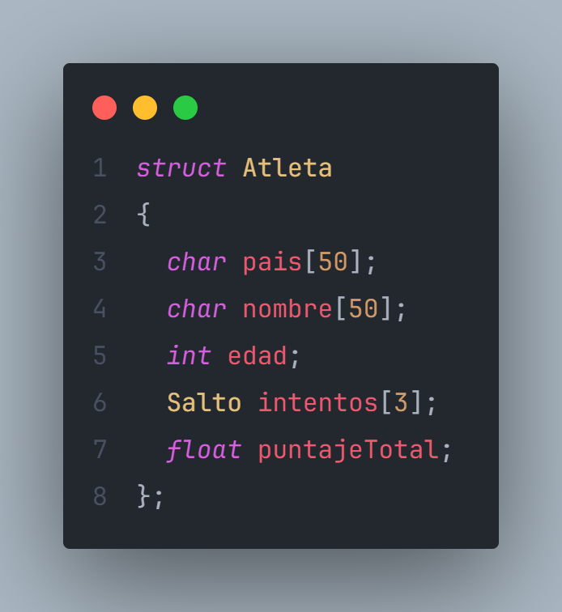
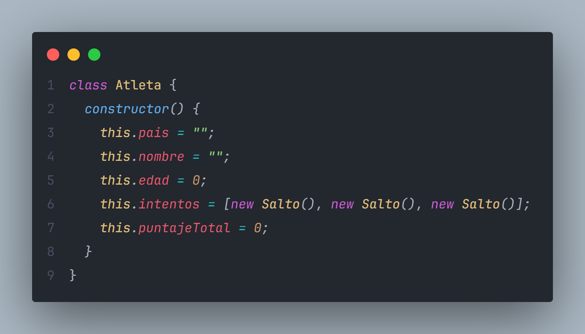
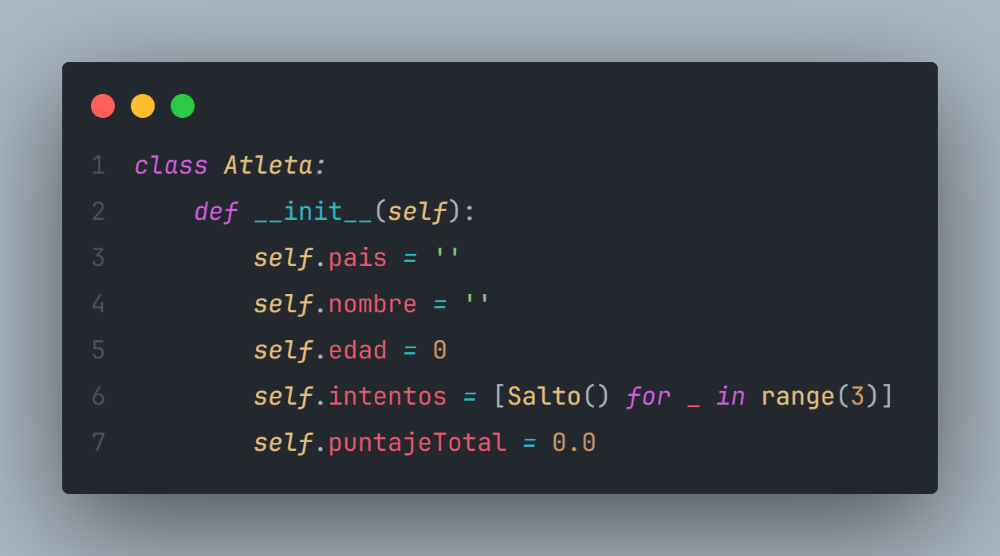

# PORYECTO PROGRAMACION

En este repositorio se encontraran ejercicios resueltos y actvidades que pertenecen al area de la programacion. Se intenta realizar cada programa bajo la logica y contexto de cada asignatura. Este repositorio es creado con fines educativos como guia para materiales como Programacion I, Programacion II o Lenguaje de Programacion, entre otros.

## LOGICA DEL REPOSITORIO

En cada carperta marcada con el lenguaje especifico se encuentra una carpeta llamada "Ejercicios generales" esta contiene los ejercicios realizado en la lista siguiente, es importante que los ejercicios se repiten mas la logica de programacion varia en base al programa, pero el fin es el mismo, como ejemplo tenemos la declaracion de estructuras:
- C++ :

- JavaScript:

- Python:

El fin de este, es que se pueda ver la estructura general e implementacion del lenguaje de programacion ya conociendo la logica del ejercicio base.

## ARCHIVOS ADICIONALES

Al igual que en cada carpeta tiene un contenido general, tambien tiene un contenido unico, son ejercicios que realizados especialmente en ese lenguaje de programacion el cual facilita y denota el aspecto unico de este.

## LISTA DE EJERCICIOS GENERALES

- ### Vendedodres y Articulos

  - Definir las estructuras.
  - Realizar una funcion para cargar los datos.
  - Una funcion para mostrar por cada vendedor aquellos productos en que no ha cubierto su cuota de ventas.
  - Una funcione que especifique en cual vendedor se ha invertido mas dinero en cursos.
  - Funcion para especificar cual es el producto mas vendido.
  - Dando el nombre de un curso, muestre las instituciones que lo dictan y cual es su costo.

- ### Municipios

  - Declarar y cargar las estructuras y variables.
  - Funcion que calcule y muestre el monto del presupuesto a cada municipio e indique que porcentaje representa del presupuesto estadal (este monto se obtiene a partir de los sectores).
  - Dado un municipio muestre nombre y poblacion de los sectores que poseen la mayor y la menor cantidad de hombres.
  - determine cual de los municipios fundados en el segundo trimestre del año, tiene menor presupuesto asignado e indique el monto.

- ### Medicos y Hospitales
- ### Atletas
